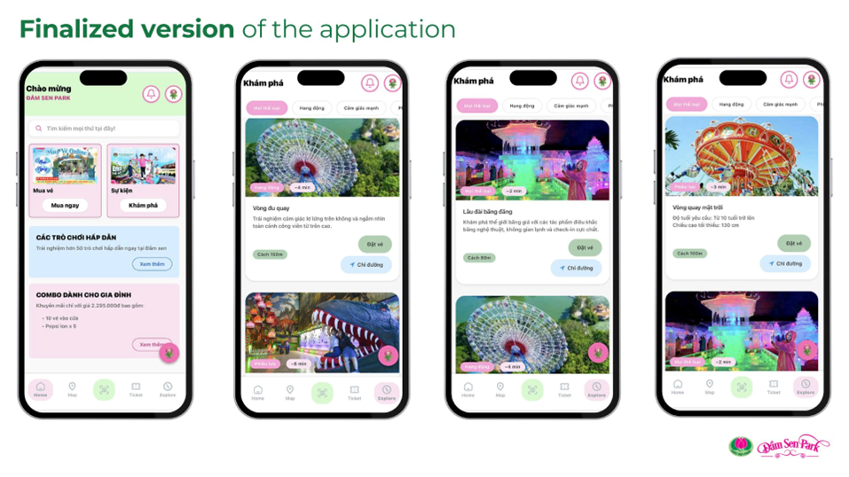
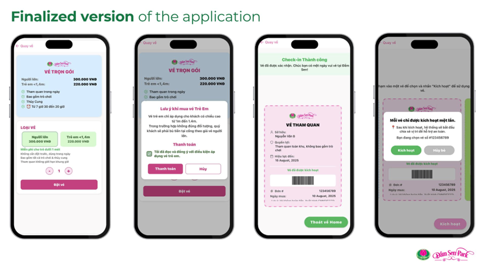
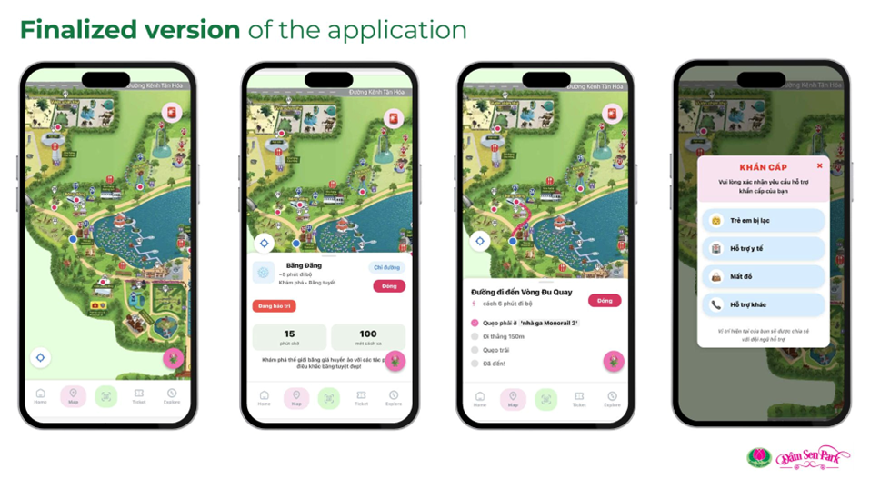
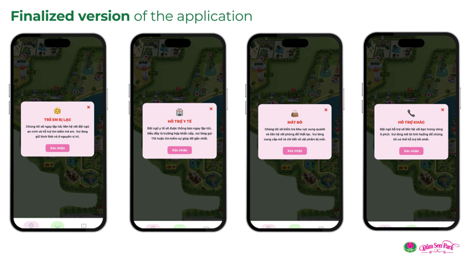

# 🎢 DamSen Park Ticket Mobile App

[](https://expo.dev)
[](https://reactnative.dev/)
[](https://www.typescriptlang.org/)
[](https://deepmind.google/technologies/gemini/)

> **Ứng dụng đặt vé và hướng dẫn tham quan Công viên Văn hóa Đầm Sen - Tích hợp AI Chatbot thông minh.**

## 📱 Tổng quan

Đây là dự án **Frontend Mobile App** (chưa có Backend) được xây dựng bằng **React Native** và **Expo Framework**. Mục tiêu chính của dự án là **trình bày ý tưởng phát triển sản phẩm** và demo các luồng tương tác (User Flow) hiện đại cho ứng dụng du lịch thông minh.

Ứng dụng tập trung vào việc tối ưu hóa trải nghiệm người dùng (UX) thông qua giao diện trực quan và các tính năng demo giả lập dữ liệu thực tế, cho thấy tiềm năng của việc số hóa công viên giải trí.

## 🌐 Demo & Tài nguyên

- **🔗 Web Demo (still online):** [https://damsenapp.netlify.app/](https://damsenapp.netlify.app/)
- **🎬 YouTube Demo:** [https://youtube.com/shorts/0-rOu0qZaA8?feature=share](https://youtube.com/shorts/0-rOu0qZaA8?feature=share)
- **🎨 Figma Design:** [Xem thiết kế UI/UX](https://www.figma.com/design/rz6JzjI710R9xLjnkebHwC/damsen-app?fuid=1465730408892692823)
- **📄 Báo cáo:** [REPORT_DamSen_Ticket_App.pdf](https://drive.google.com/file/d/15NytZqCL4v2js2MsI81zi02og9nqc1Qc/view?usp=sharing)
- **📊 Slide:** [SLIDE_DamSen_Ticket_App.pdf](https://drive.google.com/file/d/1U0Ij474_0Li8jsnhtnINOs5RL0QDi6Mi/view?usp=sharing)

## 🖼️ Ảnh demo ứng dụng

### Bản đồ tổng quan công viên


### Giao diện chính



### Luồng mua vé



### Bản đồ và điều hướng



### Tình huống khẩn cấp (SOS)



## ✨ Tính năng nổi bật

### 🤖 AI Chatbot (Gemini 2.0) - Xử lý khẩn cấp thông minh

- **Trợ lý ảo thông minh:** Tích hợp Google Gemini 2.0 Flash Lite để trò chuyện tự nhiên với du khách.
- **Kịch bản khẩn cấp (Emergency Flow):** Hệ thống được thiết kế để nhận diện ngay lập tức các từ khóa khẩn cấp (như "lạc trẻ", "cấp cứu", "mất đồ"). Chatbot sẽ chuyển sang chế độ ưu tiên, đưa ra hướng dẫn xử lý cụ thể và trấn an người dùng thay vì trả lời chung chung.

### 🗺️ Bản đồ tương tác (Interactive Map) - Trải nghiệm chi tiết

- **Thông tin điểm đến (Hotspots):** Khi chọn một địa điểm (như Lâu đài kinh dị, Vòng đu quay...), ứng dụng hiển thị đầy đủ thông tin: hình ảnh, mô tả, **thời gian chờ dự kiến** và **khoảng cách** từ vị trí hiện tại.
- **Điều hướng trực quan:** Demo tính năng chỉ đường và ước tính thời gian di chuyển giúp du khách lên kế hoạch tham quan hiệu quả.
- **Nút SOS:** Tích hợp ngay trên màn hình bản đồ để kích hoạt quy trình hỗ trợ khẩn cấp nhanh nhất.

### 🎫 Đặt vé điện tử (E-Ticket)

- **Đa dạng loại vé:** Vé cổng, Vé trọn gói, Vé Silver (bao gồm Thủy Cung).
- **Thanh toán & Lưu trữ:** Quy trình đặt vé đơn giản, lưu vé dưới dạng QR Code ngay trong ứng dụng.
- **Check-in:** Quét mã QR tại cổng soát vé (mô phỏng).

### 🎡 Khám phá & Tiện ích

- **Explore:** Danh sách trò chơi, sự kiện đang diễn ra.
- **QR Scanner:** Tích hợp Camera để quét mã check-in hoặc tra cứu thông tin.
- **Thông báo:** Cập nhật khuyến mãi và tin tức mới nhất.

## 🎨 Design System

### Màu sắc chính

- **Primary Colors:**
  - Pink: `#FF69B4`, `#FDE3F2`, `#FF8FD0`
  - Green: `#A9D0B1`, `#D1FBD0`, `#8BC34A`
  - Blue: `#D5EDFF`, `#03A9F4`, `#1976d2`
- **Neutral Colors:**
  - White: `#FFFFFF`
  - Light Gray: `#F5F5F5`, `#E8E8E8`
  - Gray: `#999999`, `#666666`
  - Dark: `#333333`, `#000000`

### Typography

- **Font Family:** System (iOS: San Francisco, Android: Roboto)
- **Sizes:** 12px - 28px
- **Weights:** 400, 500, 600, 700

### UI Patterns

- **Tab Bar:** Custom bottom tab với active state effects
- **Cards:** Rounded corners (8px-25px) với subtle shadows
- **Buttons:** Pill-shaped (borderRadius: 20-25px)
- **Modals:** Bottom sheet với draggable handle

## 🗂️ Nghiệp vụ chính

1.  **Luồng mua vé**
    Home → Ticket Tab → Chọn loại vé → Buy Ticket → Thanh toán → My Tickets
2.  **Luồng check-in**
    QR Tab → Quét mã QR tại cổng → Chọn loại vé → Xác nhận → Vào cổng
3.  **Luồng chỉ đường**
    Map Tab → Chọn điểm đến → Xem thông tin → Chỉ đường → Theo dõi route
4.  **Luồng khẩn cấp**
    Map → Nút cảnh báo → Chọn tình huống → Chatbot AI → Kết nối nhân viên

## 🔧 Tính năng nâng cao

### Interactive Map

- **Pan & Zoom:** Reanimated gestures cho smooth experience
- **Curved Pathfinding:** Thuật toán tìm đường tối ưu với Bézier curves
- **Hotspots:** 10 điểm đến với thông tin real-time
- **Current Location:** Tracking vị trí người dùng
- **Debug Mode:** Tools để fine-tune navigation paths

### AI Chatbot

- **Context-aware:** Nhớ lịch sử chat để hiểu ngữ cảnh
- **Emergency Detection:** Tự động nhận diện tình huống khẩn cấp
- **Transfer to Staff:** Chuyển sang nhân viên khi cần

### QR Scanner

- **Auto-detect:** Tự động nhận diện và xử lý mã QR
- **Real-time Processing:** Phản hồi tức thì
- **Permission Handling:** Quản lý quyền camera thông minh

## 📊 Performance

- **Bundle Size:** Optimized với code splitting
- **Animations:** 60fps với react-native-reanimated
- **Image Loading:** Lazy loading + caching
- **API Calls:** Debounced và throttled

## 🌟 Lưu ý

Đây là dự án **front-end showcase**, tập trung vào UI/UX và trải nghiệm người dùng. Backend APIs và database chưa được implement trong phiên bản này.

## 🛠️ Cài đặt và Chạy dự án

Đảm bảo bạn đã cài đặt [Node.js](https://nodejs.org/) và thiết lập môi trường cho [Expo](https://docs.expo.dev/get-started/installation/).

1.  **Clone dự án:**

    ```bash
    git clone https://github.com/Cheesenoice/DamSen-Ticket-App.git
    cd DamSen-Ticket-App
    ```

2.  **Cài đặt thư viện:**

    ```bash
    npm install
    ```

3.  **Cấu hình biến môi trường:**
    Tạo file `.env` ở thư mục gốc và thêm API Key của bạn (nếu cần):

    ```env
    EXPO_PUBLIC_GEMINI_API_KEY=your_api_key_here
    ```

4.  **Chạy ứng dụng:**

    ```bash
    npx expo start
    ```

    - Quét mã QR bằng ứng dụng **Expo Go** (Android/iOS).
    - Hoặc nhấn `w` để chạy trên trình duyệt web.

## 📂 Cấu trúc thư mục

```
DamSen-Ticket-App/
├── app/                    # Source code chính (Expo Router)
│   ├── (tabs)/             # Các màn hình chính (Home, Map, Explore...)
│   ├── chatbot.tsx         # Giao diện Chatbot
│   ├── geminiChat.ts       # Logic tích hợp Gemini API
│   └── ...
├── assets/                 # Hình ảnh, fonts, icons
├── components/             # Các component tái sử dụng (UI)
├── Slide and Report/       # Tài liệu báo cáo và Slide thuyết trình
├── app.json                # Cấu hình Expo
└── package.json            # Các thư viện phụ thuộc
```

## 👨‍💻 Tác giả & Vai trò

Tôi là người trực tiếp đảm nhiệm toàn bộ quá trình thiết kế và phát triển ứng dụng:

- **Thiết kế Flow & UI/UX:** Tự tay thiết kế toàn bộ luồng ứng dụng (App Flow) và giao diện người dùng.
- **Frontend Development:** Chịu trách nhiệm lập trình 100% Front-end.
- **Sáng tạo tính năng:** Mọi ý tưởng và sự sáng tạo trong các tính năng (như AI Chatbot, Bản đồ tương tác) đều do tôi thực hiện.

## 🤝 Đóng góp

Dự án được phát triển bởi nhóm sinh viên. Mọi đóng góp ý kiến đều được hoan nghênh!
